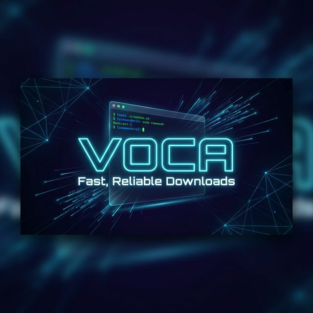

<a id="readme-top"></a>

[](https://voca.riteshrana.engineer)

<div align="center">
  <h3 align="center">Voca</h3>

  <p align="center">
    Fast, Reliable Downloads from the Command Line
    <br />
    <a href="https://voca.riteshrana.engineer/docs/index.html"><strong>Explore the docs »</strong></a>
    <br />
    <br />
    <a href="https://voca.riteshrana.engineer">View Demo</a>
    ·
    <a href="https://github.com/ambicuity/voca/issues">Report Bug</a>
    ·
    <a href="https://github.com/ambicuity/voca/issues">Request Feature</a>
  </p>
</div>

<!-- BADGES -->
<div align="center">
  <a href="https://github.com/ambicuity/voca/actions/workflows/ci.yml">
    
  </a>
  <a href="https://github.com/ambicuity/voca/releases">
    
  </a>
  <a href="https://github.com/ambicuity/voca/blob/main/LICENSE">
    
  </a>
  <a href="https://buymeacoffee.com/ritesh.rana">
    
  </a>
</div>

<br />

<!-- ABOUT THE PROJECT -->
## ⚡ About The Project

**Voca** is a high-performance network downloader designed for speed, reliability, and ease of use. Built as a lighter, faster alternative to `Wget`, it handles recursive downloads, SSL verification, and complex site mirroring with a single command.

Key capabilities:
*   🚀 **Fast**: Optimized for modern networks with intelligent retry logic.
*   🔒 **Secure**: Full SSL/TLS support (OpenSSL) with HSTS enforcement.
*   📂 **Recursive**: Smart site mirroring engine for downloading entire websites.
*   🛠 **Portable**: Native binaries for Linux and macOS (x86_64 & ARM64).
*   🍪 **Cookies**: Full support for authenticated sessions and Netscape cookie files.

<p align="right">(<a href="#readme-top">back to top</a>)</p>

<!-- GETTING STARTED -->
## 🚀 Getting Started

Voca plays nice with your existing workflow. It's a single binary with zero dependencies.

### Installation

The recommended way to install Voca is via our installer script:

```sh
curl -fsSL voca.riteshrana.engineer/install.sh | sh
```

This will automatically detect your OS/Arch and install the latest binary to `/usr/local/bin` (or ask for sudo if needed).

**Manual Installation:**
Download the binary from the [Releases Page](https://github.com/ambicuity/voca/releases), extract it, and move it to your `$PATH`.

<p align="right">(<a href="#readme-top">back to top</a>)</p>

<!-- USAGE EXAMPLES -->
## 💡 Usage

Voca uses a syntax similar to standard tools like Wget.

**Simple Download:**
```sh
voca https://example.com/file.zip
```

**Recursive Mirror (Depth 1):**
```sh
voca --recursive --level=1 https://example.com
```

**Authenticated Download (Cookies):**
```sh
voca --load-cookies=cookies.txt https://example.com/secure-file
```

**Ignore SSL Errors (Self-signed):**
```sh
voca --no-check-certificate https://localhost:8080
```

_For more examples, please refer to the [Documentation](https://voca.riteshrana.engineer/docs/index.html)_

<p align="right">(<a href="#readme-top">back to top</a>)</p>

<!-- ROADMAP -->
## 🗺️ Roadmap

- [x] Initial Release (v1.0.0)
- [x] SSL/TLS Support
- [x] Recursive Downloads
- [ ] Multi-threaded downloads
- [ ] Metalink support
- [ ] Windows Native Support (Coming soon)

See the [open issues](https://github.com/ambicuity/voca/issues) for a full list of proposed features (and known issues).

<p align="right">(<a href="#readme-top">back to top</a>)</p>

<!-- CONTRIBUTING -->
## 🤝 Contributing

Contributions are what make the open source community such an amazing place to learn, inspire, and create. Any contributions you make are **greatly appreciated**.

1.  Fork the Project
2.  Create your Feature Branch (`git checkout -b feature/AmazingFeature`)
3.  Commit your Changes (`git commit -m 'Add some AmazingFeature'`)
4.  Push to the Branch (`git push origin feature/AmazingFeature`)
5.  Open a Pull Request

<p align="right">(<a href="#readme-top">back to top</a>)</p>

<!-- LICENSE -->
## 📝 License

Distributed under the Proprietary/Open License. See `LICENSE` for more information.

<p align="right">(<a href="#readme-top">back to top</a>)</p>

<!-- CONTACT -->
## 📞 Contact

**Ritesh Rana**

[](https://x.com/mr19042000)
[](https://www.linkedin.com/in/riteshengineer/)

Project Link: [https://github.com/ambicuity/voca](https://github.com/ambicuity/voca)

<div align="center">
  <br />
  <a href="https://buymeacoffee.com/ritesh.rana" target="_blank">
    
  </a>
</div>

<p align="right">(<a href="#readme-top">back to top</a>)</p>
